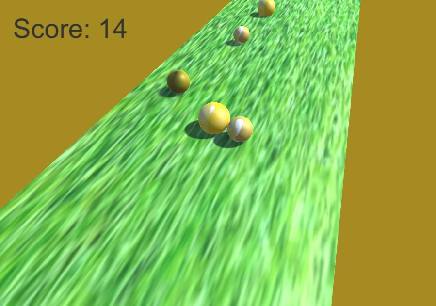

# To-Chef - Interactive cooking game
 
 

** Laughter is brightest where food is best**

 
## ScreenShots
 

## מהות המשחק

 המשחק מלמד על חומרי גלם ועל הדרך שלך להשתמש בהם לטפל בהם או לבחור אותם במטבח.
במהלך המשחק השחקן לומד איך להתמודד עם חומרי גלם במספר תהליכים שונים לפי רמות קושי, ולאורך התקדמותו יפתח עוד אלמנטים ויוכל לבצע "מבחנים" שייתנו לו תוצאה אודות היכולות שלו להתמודד עם חומרים שונים
 בתחילת במשחק השחקן יגלה את אופי המשחק בעזרת מדריך בסיסי שייתן לו הרגשה לגביי המשחק ואופן ההתעסקות.

המשחק מיועד לטלפון נייד.

---

## רכיבים רשמיים

### 1. שחקנים

* המשחק מיועד לכל גיל ובעיקר לילדים אשר רוצים לטעום מהעולם הגדול של חומרי הגלם במטבח 
* המשחק מיועד לשחקן בודד
 
### 2. יעדים

* יעד מרכזי הוא להצליח ללמוד נכון את המתכון עם החווי ובכך לצלוח את ה"מבחן" בו השחקן יבצע את הנלמד עליו בלי לשרוף ובלי לקלקל את החומר גלם  
* לשחקן תהיה בחירה בין החומרים השונים, כל חומר גלם יהיו חוקים שונים לעבוד איתו
 

### 3. תהליכים

תארו בפירוט את:

* תהליך ההתחלה של המשחק - שלושים השניות הראשונות (זה הזמן ששחקן ממוצע, שייתקל במשחק שלכם באינטרנט, ישחק בו לפני שיחליט אם להמשיך או לא. מה תעשו כדי לגרום לו להישאר?);
*	תהליך הליבה של המשחק – רצף-הפעולות שהשחקן מבצע שוב ושוב על-מנת להתקדם במשחק.
*	תהליך הסיום של המשחק – הפעולות שהשחקן מבצע כדי לנצח / לסיים את המשחק.
לגבי כל תהליך, תארו באיזה פקדים השחקן ישתמש (עכבר / מקלדת / מגע), ומה יקרה במשחק כתוצאה מכך.

איך השחקן ילמד על התהליכים? 

לגבי כל תהליך, ענו על השאלות: "מי עושה מה, איפה, מתי, ואיך?".

לגבי כל תהליך, תארו באיזה פקדים השחקן ישתמש (עכבר / מקלדת / מגע), ומה יקרה במשחק כתוצאה מכך.

### 4. חוקים

* יש זמן שרץ ומודד את פעולות השחקן
* במהלך המשחק הזמן והנסיונות לעשות דברים מסויימים (חיתוך נכון או סדר נכון) מוגבל ל3 נסיונות
* התוצאה תמדד לפי דיוק העבודה של השחקן בשלבים הקריטיים (מכוון שמדובר בבישול חלק מהתהליכים יהיו נתונים לבחירת המשתמש וחלק לא)
* לפניי כל שלב השחקן יקבל הדרכה בסיסית אודות השלב והחוקים אם מדובר בחוקים חדשים שלא נתקל בהם עדיין

### 5. משאבים

* השחקן מקבל ספר תוצאות שמתחיל בצבע אפור וככל ששולט בחומרים הם ייצבעו בספר ההשגים
* על מנת להשלים את הספר השחקן ינסה לנצח ולזכות בתואר שף
* שלבים מסויימים יהיו קשים יותר מהאחרים וזה יידרוש מהמשתמש הרבה ריכוז ודיוק
* על מנת להחשף לעוד חומרים שחסומים השחקן יאלץ להשיג התקדמות מסויימת בספר ההשגים

### 6. עימותים

מה יהיו העימותים המרכזיים במשחק:

* השחקן צריך לעמוד בלחץ זמן
* בשק הירקות או בחומר גלם אחר יהיה פגמים לפעמים שהשחקן צריך לזהות ואו לשטוף או לזרוק ולקבל חדש
* מול יריבים אחרים תהיה השוואה של ספר ההתקדמות
* דילמה של השחקן עם עצמו היא איזה חומרי גלם יבחר 

### 7. גבולות

העולם יהיה סגור 

 איך המשחק יראה לשחקן את הגבולות?
 לשחקן יהיה הסבר טוב אודות הגבולות לפני המשחק וניסיון לפני שהוא ניגש לפעולה

### 8. תוצאות

* תוצאות אפשריות הן שהשחקן יצליח לבצע את הפעולה בהצלחה, יפשל בסדר התהליך או בתזמון ואז יישרוף או יקבל תוצאה לא רצוייה 
*  התוצאה בעיקר קשורה בכישרון השחקן וביכולת שלו ולמזל אין הרבה השפעה (יכול לצוץ חומר גלם לא טוב שדורש טיפול או לא) 

---

## סקר שוק 

חפשו בגוגל, בחנות play, בפייסבוק, ובכל מקום אחר שיש לכם גישה אליו, משחקים דומים לרעיון שלכם. ציינו באיזה ביטויי-חיפוש השתמשתם.
בחנות חיפשתי:
 ingredients game, cooking game, chef game
 
 1. The Cook - 3D Cooking Game
  
 

 * המשחק המתחרה הזה הוא מציע לחתוך ירקות ולבשל אותם, מה שהופך את המשחק ליותר טוב הוא ההתייחסות הרבה יותר לחומר הגלם שיכול להיות לא טוב וגם המשמעות של פעולות במטבח כמו הכנת בצק ותפיחה במעלות הנכונות או שטיפה וייבוש כשרלוונטי.
 * בנוסף המשחק הוא לא מציע הרבה תוכן לימודי על המטבח אלא יותר "להתפרע ולהנות" מאשר מה שהטו שף מציע שזה ללמוד ולהנות
 * https://play.google.com/store/apps/details?id=com.pd.thecook

 2. Cooking Madness
 
   
 
 
* המשחק מעולה למי שרוצה משחק בסגנון מלך הפלאפל שמגיעים לקוחות וצריך להאכיל אותם, אבל במשחק טו שף תהיו עסוקים יותר בללמוד דרך פעולה של חומרים במקום להזדרז ולנסות להאכיל כמה שיותר אנשים אתה מרוכז בכל שלב בחומר אחר (כמובן שיש משמעות לזמן)
* המשחק מציע המון מנות להכנה אבל יותר מתייחס למנות שלמות ופחות למידה של עבודה עם חומרי גלם לעומת זאת טו שף תלמד את השחקן ממש על עבודה טובה עם החומרים
* https://play.google.com/store/apps/details?id=com.biglime.cookingmadness
 
 3. CookBook Master
 
  
 
 
 * המשחק דומה באופי שלו אך הלימוד שלו על חומרי הגלם הוא מינימלי והשימוש בתזמון לא מעניין מספיק בטו שף התזמון יהיה ריאלי יותר ולכן יותר לימודי
 * לדעתי משחק שבו יש כסף והתעסקויות עם יהלומים זה מכביד על המשחק ולא מושך כל כך, ההתקדמות במשחק טו שף תלויה בטכניקה של השחקן
 *https://play.google.com/store/apps/details?id=br.com.tapps.cookbookmaster
 
מבין הרכיבים הרשמיים, 
איזה רכיב (או רכיבים) ידגיש ביותר את הייחוד והמקוריות של המשחק שלכם, לעומת משחקים דומים הקיימים בשוק?

